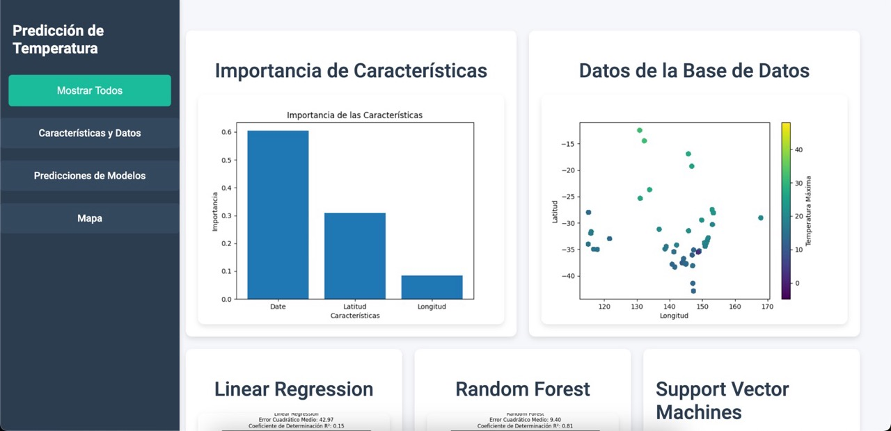
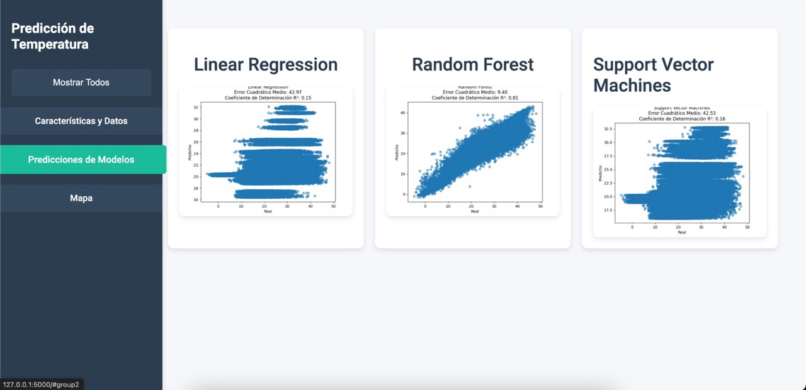
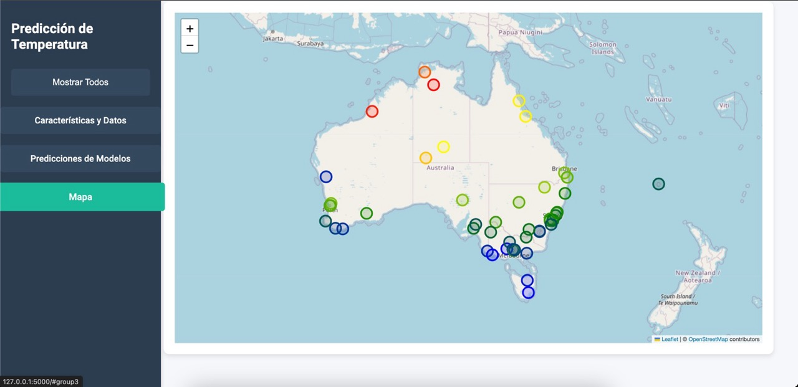
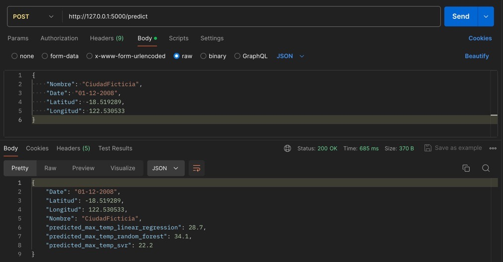

# TempPredictor-Dashboard

TempPredictor-Dashboard es una aplicación web desarrollada con Flask que permite predecir las temperaturas máximas en Australia utilizando varios modelos de regresión ya entrenados. La aplicación presenta las predicciones y los datos en un tablero interactivo, incluyendo gráficos y un mapa de visualización.

## Características

- Predicción de temperaturas máximas utilizando modelos de:
  - Regresión Lineal
  - Bosque Aleatorio
  - Máquinas de Soporte Vectorial (SVR)
- Visualización de la importancia de las características.
- Mapa interactivo mostrando las predicciones de temperatura en varias ubicaciones.
- Gráficos de comparación entre valores reales y predichos.

## Capturas de Pantalla

### Página Principal / Importancia de las Características



### Predicciones del Modelo



### Mapa Interactivo



### Uso de la API



## Instalación

1. Clona el repositorio:
    ```bash
    git clone https://github.com/ignaciovillela/TempPredictor-Dashboard.git
    ```

2. Navega al directorio del proyecto:
    ```bash
    cd TempPredictor-Dashboard
    ```

3. Crea un entorno virtual:
    ```bash
    python -m venv env
    ```

4. Activa el entorno virtual:
    - En Windows:
      ```bash
      .\env\Scripts\activate
      ```
    - En macOS/Linux:
      ```bash
      source env/bin/activate
      ```

5. Instala las dependencias:
    ```bash
    pip install -r requirements.txt
    ```

## Uso

1. Asegúrate de que los modelos entrenados y el scaler estén en el directorio `models`.

2. Ejecuta la aplicación Flask:
    ```bash
    python -m flask run  
    ```

3. Abre tu navegador y ve a `http://127.0.0.1:5000`.

4. Desde la interfaz principal, puedes navegar entre diferentes secciones del tablero utilizando el menú lateral.

5. En la sección de **Predicciones de Modelos**, verás gráficos que muestran la comparación entre los valores reales y predichos para cada modelo: Regresión Lineal, Bosque Aleatorio y Máquinas de Soporte Vectorial.

6. Para realizar nuevas predicciones, envía los datos de entrada a través de la interfaz. Los nuevos puntos de predicción se agregarán al mapa interactivo, que puedes encontrar en la sección **Mapa**. Este mapa muestra las predicciones de temperatura en varias ubicaciones con un código de colores para una visualización fácil.
